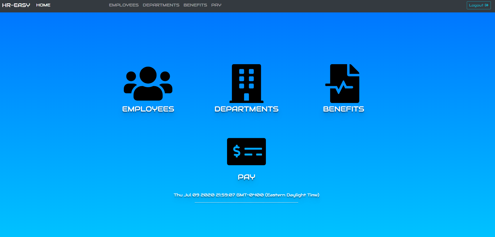
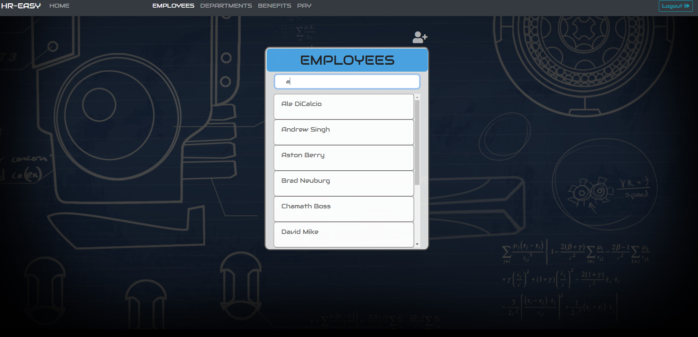
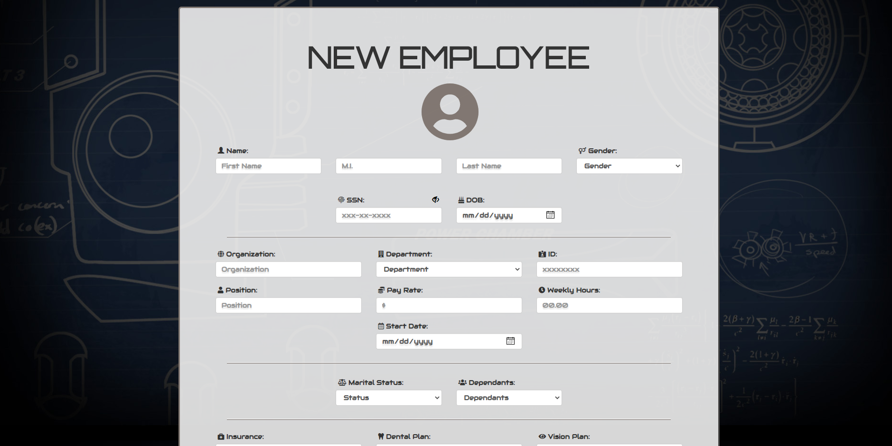
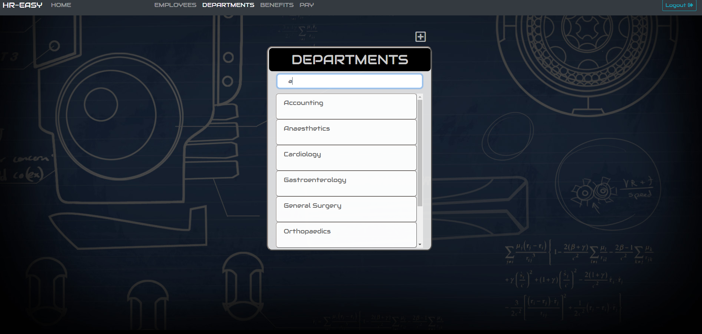
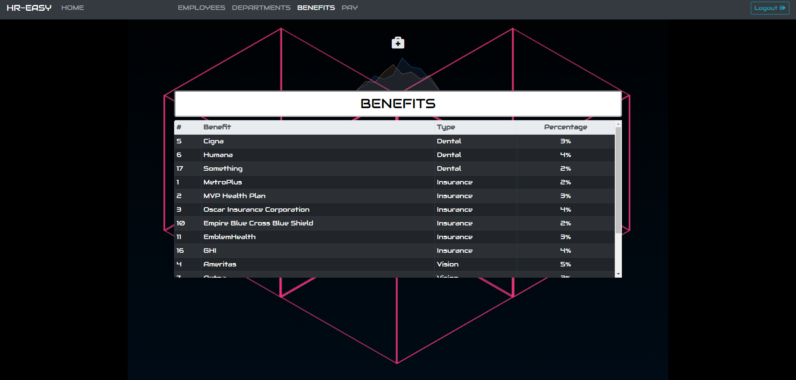
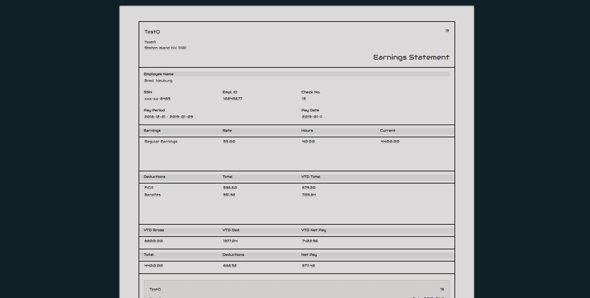

# freehreasy
A web application made using javascript, php, html, and mysql. It allows businesses to add or edit employee information, add
multiple departments, assign employees to departments, and manage employee benefits and pay. It was done as a project to be HR software
that a company could use to deal with employee benefits and pay. 

# Installion
No need to install any software as it's a website that is up and runnning at [HR easy](https://www.freehreasy.com/)

# Screenshots

